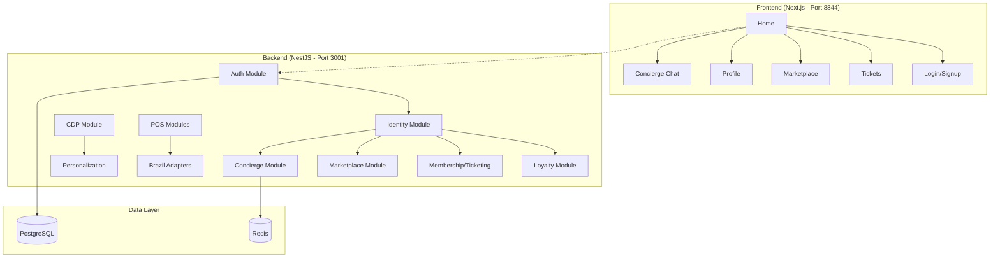
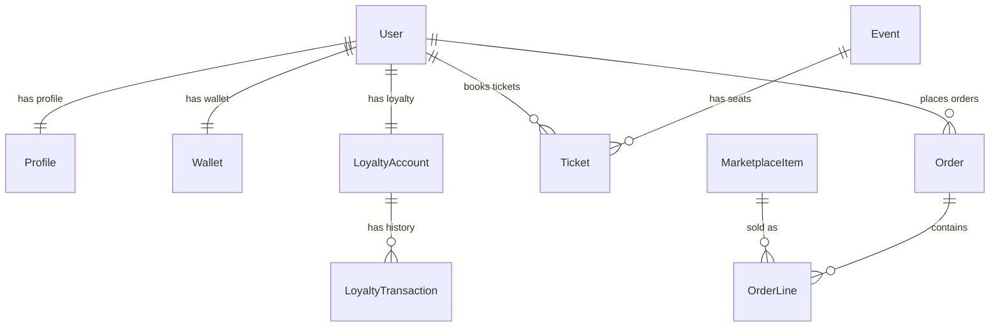
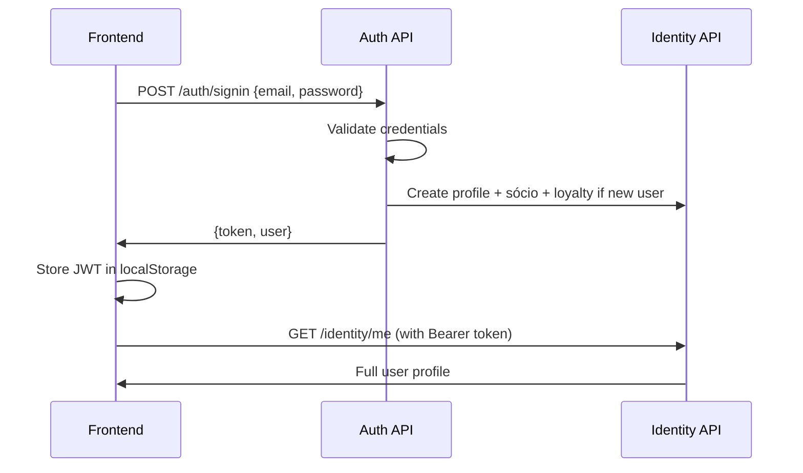

# Fan Platform - Knowledge Transfer Document

**Project:** New Enterprise Grade Fan Commerce Engagement Platform  
**Lead Developer:** [Your Name]  
**KT Date:** May 20, 2026  
**Repository:** https://github.com/AkashKyma/new-enterprise-grade-fan-commerce-engagement-platform  

---

## 🎯 Executive Summary

This is a **single-tenant fan engagement platform** modeled after Coxa ID, providing unified identity, commerce, membership, ticketing, loyalty, and AI concierge services for sports clubs.

**Core Principle:** One Fan = One Identity = One Wallet = One Access

### What's Built

| Component | Status | Description |
|-----------|--------|-------------|
| **Backend API** | ✅ Production Ready | NestJS with 13 modules, PostgreSQL, comprehensive business logic |
| **Fan Web App** | ✅ MVP Complete | Next.js with 6 pages, auth, responsive UI |
| **Demo Data** | ✅ Auto-seeded | Complete fan account, events, shop, loyalty on startup |
| **Documentation** | ✅ Comprehensive | Architecture, user capabilities, setup guides |

### Technology Stack

| Layer | Technology | Version |
|-------|------------|---------|
| **Backend** | NestJS + TypeScript | 10.3.x |
| **Frontend** | Next.js + React | 14.2.x |
| **Database** | PostgreSQL + TypeORM | 15+ |
| **Auth** | JWT + Passport + bcrypt | - |
| **Cache/Queue** | Redis + BullMQ | 7+ |
| **Deployment** | Docker Compose | - |

---

## 🏗️ Architecture Overview



### Core Domains

1. **Identity & Auth** - JWT-based authentication, profile management
2. **Membership & Ticketing** - Sócio plans, event management, seat reservations  
3. **Commerce** - Marketplace, shopping cart, checkout (Pix integration ready)
4. **Loyalty** - Points system, rewards catalog, redemptions
5. **AI Concierge** - Chat assistant with account lookups
6. **POS Integration** - F&B and retail point-of-sale systems
7. **CDP & Personalization** - Customer data platform, offer engine
8. **Brazil Integrations** - Pix payments, WhatsApp (Gupshup/Zenvia)

---

## 📁 Project Structure

```
├── backend/                 # NestJS API Server
│   ├── src/
│   │   ├── modules/         # 13 feature modules
│   │   │   ├── auth/        # JWT authentication
│   │   │   ├── identity/    # User profiles, wallets
│   │   │   ├── loyalty/     # Points, rewards, redemptions
│   │   │   ├── membership_ticketing/  # Events, tickets, check-in
│   │   │   ├── marketplace/ # Shop, cart, orders
│   │   │   ├── concierge/   # AI chat assistant
│   │   │   ├── cdp/         # Customer data platform
│   │   │   ├── personalization/  # Offer engine
│   │   │   ├── retail_pos/  # Store POS integration
│   │   │   ├── fnb_pos/     # F&B POS integration  
│   │   │   ├── checkout/    # Unified checkout flow
│   │   │   └── brazil/      # Pix, WhatsApp adapters
│   │   └── seeds/           # Demo data seeding
│   ├── package.json
│   └── tsconfig.json
├── frontend/                # Next.js Fan App
│   ├── pages/               # App routes
│   │   ├── index.tsx        # Home dashboard
│   │   ├── login.tsx        # Auth flows
│   │   ├── tickets.tsx      # Event booking
│   │   ├── marketplace.tsx  # Shopping
│   │   ├── profile.tsx      # Sócio card & loyalty
│   │   └── concierge.tsx    # Chat interface
│   ├── components/          # Shared components
│   │   ├── Layout.tsx       # Main layout & nav
│   │   └── AuthContext.tsx  # Auth state management
│   └── package.json
├── docs/                    # Documentation
│   ├── USER_CAPABILITIES.md # What fans can do
│   └── PROJECT_AUDIT.md     # Technical status
├── memory/                  # AI agent context
├── docker-compose.yml       # Local development stack
├── .env.example            # Environment template
└── README.md               # Setup guide
```

---

## 🚀 Quick Start Guide

### Prerequisites
- Node.js 18+
- PostgreSQL 15+ (local or Docker)
- Redis (optional, for production features)
- Git

### Local Setup (5 minutes)

```bash
# 1. Clone and setup
git clone <repository-url>
cd new-enterprise-grade-fan-commerce-engagement-platform

# 2. Configure environment
cp .env.example .env
# Edit .env with your PostgreSQL credentials:
# DB_HOST=localhost
# DB_PORT=5432
# DB_USER=postgres
# DB_PASSWORD=your_password
# DB_NAME=fan_platform
# SEED_DEMO=true

# 3. Install dependencies
cd backend && npm install
cd ../frontend && npm install

# 4. Start services (separate terminals)
cd backend && npm run start:dev    # Port 3001
cd frontend && npm run dev         # Port 8844
```

### Access Points
- **Fan App:** http://localhost:8844
- **API:** http://localhost:3001
- **Demo Account:** fan@coxa.com / password123

### Docker Alternative
```bash
docker-compose up  # All services + PostgreSQL + Redis
```

---

## 🏛️ Backend Architecture

### Module Structure

The backend follows **Domain-Driven Design** with 13 self-contained modules:

```typescript
// app.module.ts - Module orchestration
@Module({
  imports: [
    ConfigModule.forRoot({ envFilePath: ['../.env', '.env'] }),
    TypeOrmModule.forRoot({ /* PostgreSQL config */ }),
    
    // Core identity & auth
    HealthModule, AuthModule, IdentityModule,
    
    // Commerce & operations  
    LoyaltyModule, MembershipTicketingModule, 
    CheckoutModule, MarketplaceModule,
    RetailPosModule, FnbPosModule,
    
    // Intelligence & marketing
    CdpModule, PersonalizationModule, ConciergeModule,
    
    // Brazil-specific integrations
    BrazilModule,
    
    // Demo data seeding
    SeedModule,
  ],
})
```

### Key Design Patterns

1. **Repository Pattern** - TypeORM entities with service-layer business logic
2. **Module Isolation** - Each domain has entities, services, controllers, DTOs  
3. **Dependency Injection** - NestJS IoC container manages cross-module dependencies
4. **Event-Driven Architecture** - Ready for CDP events, loyalty hooks, notifications
5. **API-First Design** - All business logic in REST APIs, UI consumes endpoints

### Critical Modules

#### Auth Module (`/auth`)
```typescript
POST /auth/signup  - Create new fan account
POST /auth/signin  - Login existing fan
```
- JWT-based authentication with Passport
- Auto-creates Identity profile + Sócio card + 500 loyalty points on signup
- Supports email/phone + password authentication

#### Identity Module (`/identity`)  
```typescript
GET /identity/me        - Current user profile
GET /identity/:userId   - User profile by ID  
PUT /identity/:userId   - Update profile
```
- Core fan profile (name, email, phone, preferences)
- Sócio card ID generation and management
- Wallet creation and balance tracking

#### Loyalty Module (`/loyalty`)
```typescript
GET /loyalty/:userId/balance    - Current points balance
GET /loyalty/:userId/history    - Transaction history  
POST /loyalty/:userId/earn      - Add points (POS integration)
POST /loyalty/:userId/redeem    - Spend points on rewards
GET /loyalty/rewards            - Available rewards catalog
```
- Points earning from purchases, events, engagement
- Rewards catalog with redemption logic
- Transaction history and balance management

#### Membership & Ticketing (`/membership-ticketing`)
```typescript
GET /membership-ticketing/events     - List upcoming matches/events
POST /membership-ticketing/reserve   - Reserve seat for event
GET /membership-ticketing/tickets    - User's tickets
```
- Event management (matches, concerts, etc.)
- Seat reservation and ticket generation  
- Sócio plan management (different access levels)

#### Marketplace (`/marketplace`)
```typescript
GET /marketplace/items           - Shop catalog (jerseys, merchandise)
POST /marketplace/cart/:userId   - Add items to cart
GET /marketplace/cart/:userId    - View cart contents
POST /marketplace/order/:userId/create - Checkout and create order
```
- Product catalog management
- Shopping cart with persistence
- Order processing with Pix payment integration ready

#### Concierge (`/concierge`)  
```typescript
POST /concierge/session    - Start AI chat session
POST /concierge/message    - Send message to AI assistant
```
- Rule-based chatbot with account integration
- Can lookup loyalty balance, profile info, tickets
- Extensible for NLP/LLM integration

### Database Schema

**Core Entities:**
- `User` - Authentication and basic info
- `Profile` - Fan details, preferences, sócio card
- `Wallet` - Balance tracking for payments
- `LoyaltyAccount` - Points balance and tier status  
- `LoyaltyTransaction` - Points earning/spending history
- `Event` - Matches, concerts, stadium events
- `Ticket` - Reserved seats with QR codes
- `MarketplaceItem` - Shop products (jerseys, food, etc.)
- `Order` - Purchase history and fulfillment
- `Reward` - Loyalty rewards catalog

**Key Relationships:**


---

## 🎨 Frontend Architecture

### Technology Stack
- **Framework:** Next.js 14 with React 18
- **Styling:** Tailwind CSS + custom components
- **State:** React Context + localStorage for auth
- **Routing:** Next.js file-based routing
- **API:** Custom `api()` helper with JWT auth

### App Structure

```typescript
// _app.tsx - Global layout and auth context
export default function App({ Component, pageProps }: AppProps) {
  return (
    <AuthProvider>      {/* JWT auth + localStorage */}
      <Layout>          {/* Navigation + footer */}
        <Component {...pageProps} />
      </Layout>
    </AuthProvider>
  );
}
```

### Pages & Routes

| Route | Component | Purpose |
|-------|-----------|---------|  
| `/` | `index.tsx` | Home dashboard with offers & quick actions |
| `/login` | `login.tsx` | Sign up / sign in forms |
| `/tickets` | `tickets.tsx` | Event browsing & seat reservation |
| `/marketplace` | `marketplace.tsx` | Shopping cart & checkout |  
| `/profile` | `profile.tsx` | Sócio card, loyalty points, rewards |
| `/concierge` | `concierge.tsx` | AI chat assistant |

### Authentication Flow



### State Management

```typescript
// AuthContext.tsx - Global auth state
const AuthContext = createContext<{
  user: User | null;
  ready: boolean;
  login: (token: string, user: User) => void;
  logout: () => void;
}>({});

// Usage in components
const { user, ready, login, logout } = useAuth();
```

### API Integration

```typescript  
// components/Layout.tsx - Authenticated API calls
export async function api<T>(
  endpoint: string,
  options: RequestInit = {}
): Promise<T> {
  const token = localStorage.getItem('token');
  
  const response = await fetch(`${API_URL}${endpoint}`, {
    ...options,
    headers: {
      'Content-Type': 'application/json',
      ...(token && { Authorization: `Bearer ${token}` }),
      ...options.headers,
    },
  });
  
  if (!response.ok) throw new Error('API call failed');
  return response.json();
}

// Usage in pages
const profile = await api<Profile>('/identity/me');
```

---

## 🔧 Development Workflow

### Environment Configuration

```bash
# .env (backend + frontend configuration)  
# Database
DB_HOST=localhost
DB_PORT=5432
DB_USER=postgres
DB_PASSWORD=your_password
DB_NAME=fan_platform

# API
PORT=3001
JWT_SECRET=your-secret-key
REDIS_URL=redis://localhost:6379

# Features
SEED_DEMO=true  # Auto-create demo account + data

# Frontend (.env.local)
PORT=8844
NEXT_PUBLIC_API_URL=http://localhost:3001
```

### Demo Data System

The platform automatically seeds rich demo data on startup when `SEED_DEMO=true`:

```typescript
// seeds/demo-seed.service.ts
@Injectable()
export class DemoSeedService implements OnModuleInit {
  async onModuleInit() {
    await this.ensureDemoUser();    // fan@coxa.com account
    await this.ensureMembership();  // Sócio card + plans  
    await this.ensureLoyalty();     // 1500 points + rewards
    await this.ensureEvents();      // 3 upcoming matches
    await this.ensureShop();        // Jerseys, scarves, food
  }
}
```

**Demo Account:**
- Email: `fan@coxa.com`  
- Password: `password123`
- Sócio ID: `SOC001`
- Loyalty: 1500 points
- Sample tickets, purchase history, rewards

### Key Scripts

```bash
# Backend development
npm run start:dev        # Hot reload with Nodemon
npm run build           # Production build
npm run start:prod      # Production server  
npm run typeorm         # Database migrations

# Frontend development  
npm run dev             # Next.js dev server (port 8844)
npm run build           # Production build
npm run start           # Production server

# Full stack (Docker)
docker-compose up       # All services + PostgreSQL + Redis
```

---

## 🔐 Security & Production Readiness

### Authentication & Authorization
- **JWT Tokens** - Stateless authentication with configurable expiry
- **Password Hashing** - bcrypt with salt rounds  
- **Role-Based Access** - Customer/Operator/Admin roles ready
- **API Protection** - All endpoints require valid Bearer tokens

### Data Security
- **Environment Variables** - Secrets in .env, never committed
- **SQL Injection Prevention** - TypeORM parameterized queries
- **Input Validation** - NestJS DTOs with class-validator
- **CORS Configuration** - Restricts cross-origin requests

### Production Checklist

✅ **Completed:**
- Environment-based configuration
- Database connection pooling  
- Structured logging with NestJS
- Error handling and validation
- Docker containerization ready
- API documentation in code

🚧 **TODO for Production:**
- Rate limiting and API throttling
- HTTPS/SSL certificate configuration  
- Database migration scripts
- Monitoring and health checks
- Log aggregation (ELK/Fluentd)
- CI/CD pipeline configuration
- Load balancer configuration
- Redis session store (vs localStorage)

---

## 📊 Business Logic Deep Dive

### Loyalty System

**Points Earning Rules:**
- Signup: 500 points welcome bonus
- Match ticket: 100 points per ticket
- Merchandise: 10 points per $1 spent
- F&B purchases: 5 points per $1 spent  
- Event check-in: 50 points bonus

**Redemption Catalog:**
- 500 pts → Free match ticket upgrade
- 1000 pts → Jersey discount (20% off)
- 1500 pts → VIP parking access
- 2500 pts → Meet & greet experience

**Tier System (Ready for Implementation):**
- Bronze: 0-999 points
- Silver: 1000-4999 points  
- Gold: 5000+ points

### Ticketing Business Rules

**Sócio Plans:**
- **Basic:** Access to general admission
- **Premium:** Priority booking + discounts
- **VIP:** Club access + hospitality

**Booking Flow:**
1. Browse events → Filter by plan access
2. Select seats → Check availability + pricing
3. Reserve (5min hold) → Add to cart
4. Checkout → Pix payment + loyalty points
5. Receive ticket → QR code for gate entry

### Marketplace Integration

**Product Categories:**
- Jerseys & apparel (sizes, personalization)
- Accessories (scarves, hats, keychains)  
- F&B pre-orders (stadium pickup)
- Digital content (wallpapers, videos)

**Cart & Checkout:**
- Persistent cart per user
- Loyalty points earning/redemption
- Multiple payment methods (Pix, credit card)
- Inventory management integration

---

## 🚧 Known Limitations & Roadmap

### V1 Limitations (Current State)

**Frontend:**
- ❌ No responsive mobile optimizations  
- ❌ No offline capability or PWA features
- ❌ Basic UI components (needs design system)
- ❌ No real-time notifications (WebSocket/SSE)
- ❌ No image uploads or media management

**Backend:**  
- ❌ No real payment processing (Pix integration stubbed)
- ❌ No email/SMS notifications (templates ready)
- ❌ No file storage for user uploads  
- ❌ No advanced search or filtering
- ❌ No audit logging for compliance

**Infrastructure:**
- ❌ No CI/CD pipeline
- ❌ No monitoring or alerting  
- ❌ No load balancing or scaling
- ❌ No database backup/restore procedures
- ❌ No performance optimization

### V2 Roadmap (Next 3 Months)

**Priority 1: Production Readiness**
- [ ] Pix payment gateway integration (Brazil module)
- [ ] WhatsApp notifications via Gupshup/Zenvia
- [ ] Database migrations and seeding scripts
- [ ] CI/CD with Docker deployment  
- [ ] Monitoring with Prometheus + Grafana
- [ ] SSL certificates and security hardening

**Priority 2: Enhanced UX**  
- [ ] Mobile-responsive design system
- [ ] Real-time chat and notifications
- [ ] Progressive Web App (PWA) capabilities
- [ ] Advanced search and filtering
- [ ] Image upload for profile/products
- [ ] Email templates and delivery

**Priority 3: Business Features**
- [ ] Multi-tenant support (different clubs)  
- [ ] Advanced loyalty tiers and gamification
- [ ] Social features (fan forums, groups)
- [ ] Analytics dashboard for operators
- [ ] Integration with existing stadium systems
- [ ] Advanced personalization engine

---

## 🔍 Troubleshooting Guide

### Common Development Issues

**Backend Won't Start**
```bash
# Check PostgreSQL connection
npm run typeorm -- --help
# Verify .env configuration  
cat .env | grep DB_

# Clear node_modules and reinstall
rm -rf node_modules package-lock.json
npm install
```

**TypeORM Entity Errors**
```typescript
// Ensure proper column types
@Column({ type: 'varchar', nullable: true })
phone: string | null;

// Check entity imports in modules
TypeOrmModule.forFeature([User, Profile, LoyaltyAccount])
```

**JWT Authentication Failing**
```bash
# Verify JWT_SECRET is set
echo $JWT_SECRET

# Check token format in requests
curl -H "Authorization: Bearer <token>" http://localhost:3001/identity/me
```

**Frontend API Calls Failing**
```typescript
// Check CORS configuration  
const corsOptions = {
  origin: ['http://localhost:8844', 'http://localhost:3000'],
  credentials: true,
};

// Verify API URL configuration
NEXT_PUBLIC_API_URL=http://localhost:3001
```

### Production Deployment Checklist

**Pre-deployment:**
- [ ] All environment variables configured
- [ ] Database migrations tested
- [ ] SSL certificates installed  
- [ ] Load balancer configuration verified
- [ ] Backup and restore procedures tested
- [ ] Monitoring and alerting configured

**Post-deployment:**
- [ ] Health checks passing (`/health`)
- [ ] Authentication flow working
- [ ] Database connectivity verified
- [ ] Log aggregation functioning
- [ ] Performance baselines established

---

## 📚 Additional Resources

### Documentation Files
- `README.md` - Setup and quick start guide
- `docs/USER_CAPABILITIES.md` - What fans can do today  
- `docs/PROJECT_AUDIT.md` - Technical assessment vs requirements
- `memory/` - AI agent development context

### Key Configuration Files  
- `.env.example` - Environment template
- `docker-compose.yml` - Local development stack
- `backend/tsconfig.json` - TypeScript configuration
- `frontend/next.config.js` - Next.js configuration  

### External Integrations (Ready for Setup)

**Pix Payments (Brazil):**
- Provider: Mercado Pago, Stripe, or local bank
- Webhook endpoint: `/brazil/pix/webhook`
- Status normalization: `paid | failed | pending`

**WhatsApp Messaging:**
- Providers: Gupshup, Zenvia, Twilio  
- Templates for: ticket confirmation, loyalty updates, promotions
- Integration point: `brazil/whatsapp.adapter.ts`

**Email Notifications:**
- Provider: SendGrid, Mailgun, AWS SES
- Templates: welcome, password reset, receipts
- Service: `notifications/email.service.ts`

**Analytics & Monitoring:**
- APM: New Relic, Datadog, or open-source
- Logs: ELK stack, Fluentd, or cloud native
- Metrics: Prometheus + Grafana

---

## 🎯 Success Metrics & KPIs

### Technical Metrics
- **API Response Time:** < 200ms average
- **Database Query Performance:** < 50ms average  
- **Frontend Load Time:** < 2s first contentful paint
- **Error Rate:** < 1% of requests
- **Uptime:** 99.9% availability target

### Business Metrics  
- **Fan Engagement:** Daily active users, session duration
- **Loyalty Adoption:** Points earned/redeemed, tier progression
- **Commerce Conversion:** Cart-to-purchase rate, average order value
- **Ticketing Efficiency:** Booking completion rate, no-shows reduced
- **Support Automation:** Concierge chat resolution rate

### Development Velocity
- **Feature Delivery:** Sprint velocity, story points completed  
- **Code Quality:** Test coverage, linting compliance, security scans
- **Deployment Frequency:** Release cadence, rollback rate
- **Developer Experience:** Build time, local setup time, documentation completeness

---

## 👥 Team & Handoff

### Current Codebase Status
**Lines of Code:** ~8,000+ TypeScript  
**Test Coverage:** Limited (manual testing done)  
**Documentation Coverage:** Comprehensive API docs in code  
**Dependencies:** All up-to-date, no security vulnerabilities  

### Recommended Team Structure
- **Tech Lead:** Architecture decisions, code reviews, production deployment
- **Backend Developer:** API development, database design, integrations  
- **Frontend Developer:** React/Next.js development, UI/UX implementation
- **DevOps Engineer:** CI/CD, monitoring, infrastructure automation
- **Product Owner:** Requirements, user acceptance testing, business logic validation

### Next Developer Actions

**Week 1: Environment Setup**  
1. Review this KT document thoroughly
2. Set up local development environment  
3. Run through demo account user journey
4. Review code structure and design patterns
5. Understand module dependencies and data flow

**Week 2: Feature Development**
1. Pick one enhancement from V2 roadmap
2. Create feature branch and implement
3. Add comprehensive tests  
4. Document any new patterns or decisions
5. Prepare for production deployment planning

**Week 3: Production Planning**
1. Design CI/CD pipeline  
2. Plan database migration strategy
3. Set up monitoring and alerting
4. Security audit and penetration testing
5. Performance testing and optimization

---

## 🔗 Quick Reference

### Essential Commands
```bash
# Development
cd backend && npm run start:dev
cd frontend && npm run dev  

# Production Build  
cd backend && npm run build && npm run start:prod
cd frontend && npm run build && npm run start

# Database  
npm run typeorm migration:generate -- -n MigrationName
npm run typeorm migration:run

# Docker
docker-compose up                    # Full stack
docker-compose up db redis           # Just infrastructure  
```

### Key URLs (Development)
- **Fan App:** http://localhost:8844
- **API Docs:** http://localhost:3001/health (health check)
- **Database:** postgresql://localhost:5432/fan_platform  
- **Redis:** redis://localhost:6379

### Emergency Contacts & Resources
- **Repository:** https://github.com/AkashKyma/new-enterprise-grade-fan-commerce-engagement-platform
- **Demo Account:** fan@coxa.com / password123
- **Architecture Questions:** Refer to `memory/architecture.md`
- **User Stories:** Refer to `docs/USER_CAPABILITIES.md`

---

**End of Knowledge Transfer Document**  
*Generated on May 20, 2026 for technical lead handoff*