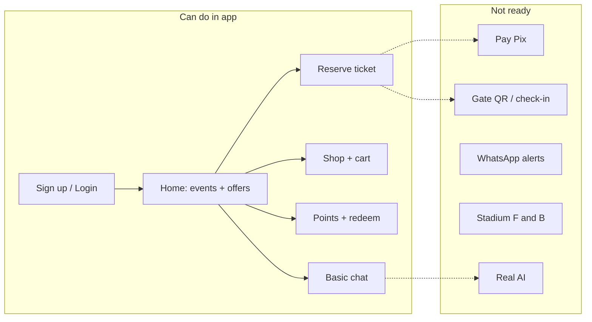

# Fan Platform — What Users Can Do Today

**Audience:** Product, stakeholders, and developers  
**Perspective:** Normal fan using the web app (not admin/API integrator)  
**Last updated:** 2026-05-19

---

## What the product is

A **Coxa ID–style fan hub**: one login for identity, tickets, shop, loyalty points, and a simple assistant. Think club app + light e-commerce — not a finished stadium/POS product yet.

| Item | Value |
|------|--------|
| Fan app URL | `http://localhost:8844` |
| API | `http://localhost:3001` |
| Demo login | `fan@coxa.com` / `demo1234` |

**Principle:** One Fan = One Identity = One Wallet = One Access

---

## What a user CAN do today (in the UI)

### 1. Account & identity

| Action | Works? | Notes |
|--------|--------|--------|
| Create account (email + password) | Yes | e.g. `akash@gmail.com` |
| Sign in / sign out | Yes | Session stored in browser (`fp_user`) |
| See who they are in the nav | Yes | Email shown when logged in |
| Welcome on home | Yes | e.g. “Welcome back, akash” |

On sign-in or sign-up, the backend also creates **profile**, **sócio card ID**, and **500 welcome points** (once per account).

---

### 2. Home

| Action | Works? | Notes |
|--------|--------|--------|
| See upcoming matches | Yes | Same events for all users (from database) |
| See offers | Yes | Generic (e.g. 10% kiosk, combo F&B) — not deeply personal yet |
| See redeemable rewards preview | Yes | From loyalty catalog |
| Quick links | Yes | Tickets, Shop, Concierge, My Account |
| Guest browse | Partial | Must sign in for personalized blocks; logged-out home shows sign-in prompts |

---

### 3. Tickets

| Action | Works? | Notes |
|--------|--------|--------|
| Browse match list | Yes | e.g. Coxa vs Athletico, Derby |
| Pick stand/section | Yes | North, South, VIP, etc. |
| Reserve a seat | Yes | Calls real API; login required |
| Pay with Pix | No | UI label: “Pix placeholder” — no QR, no payment |
| View “my tickets” history | No | Only tickets reserved **this browser session** |
| Show QR at stadium gate | No | Placeholder icon only |
| Check-in at gate | No | API exists; no fan-facing UI |

---

### 4. Shop (marketplace)

| Action | Works? | Notes |
|--------|--------|--------|
| Browse club products | Yes | Jersey, scarf, cap, mug, bundle (seeded data) |
| Add to cart | Yes | Login required |
| See cart total | Yes | |
| Checkout | Partial | Creates order in database; **no real Pix payment** |
| Track order / delivery | No | No “My orders” page |

---

### 5. My Account (sócio card + loyalty)

| Action | Works? | Notes |
|--------|--------|--------|
| View sócio-style card | Yes | Email, membership ID, points, role |
| See loyalty balance | Yes | e.g. 500 (new user) or 2,500 (demo fan) |
| See points history | Yes | If they have ledger transactions |
| Redeem rewards | Yes | If enough points (soda, discount, parking, VIP, etc.) |
| Renew / upgrade membership plan | No | No plan picker UI |
| Edit profile (name, phone, CPF) | No | Backend supports `traits`; no edit form |

---

### 6. Concierge (chat)

| Action | Works? | Notes |
|--------|--------|--------|
| Open chat | Yes | |
| Use quick-question chips | Yes | Points, tickets, offers, membership |
| Get answers about points / identity | Partial | Rule-based; reads real APIs for balance/profile |
| Full AI conversation | No | No Gemini/OpenAI — scripted replies + prompt stub |
| WhatsApp chat | No | Backend adapters for ops; not in fan app |

---

## What a user CANNOT do yet

These are in the **vision / backend** but not a complete fan experience:

| Area | Missing for users |
|------|-------------------|
| **Payments** | Real Pix QR, payment confirmation, refunds |
| **Membership** | Buy/renew sócio plan, benefits page, priority windows in UI |
| **Stadium** | Buy beer/food at kiosk linked to fan ID, F&B menu |
| **Retail stores** | In-store purchase linked to fan — operator APIs only |
| **Notifications** | WhatsApp / SMS / email (“your ticket is ready”) |
| **Gate access** | Facial recognition, digital ticket wallet |
| **History** | Order history, ticket history across sessions |
| **Personalization** | Truly unique offers per fan (mostly shared demo content) |
| **Locale** | Full Portuguese UX, CPF, Brazilian address flows |

---

## User journey map (current state)

---

## Shared vs per-account data

| Data | Per user? |
|------|-----------|
| Events, shop catalog, generic offers | **Shared** — everyone sees similar home content |
| Points, sócio ID, redemptions, cart, reservations | **Per account** — tied to login `userId` |
| Demo fan (`fan@coxa.com`) | Extra seed: 2,500 pts + Ouro membership |

**Important:** Home can look similar for every user; **My Account** is where accounts differ.

---

## Fan pages in the app

| Route | Purpose |
|-------|---------|
| `/` | Home — events, offers, rewards, quick links |
| `/login` | Sign in / sign up |
| `/tickets` | Browse events, reserve seat |
| `/marketplace` | Shop, cart, checkout (Pix stub) |
| `/concierge` | Chat assistant |
| `/profile` | Sócio card, loyalty, redeem |

---

## Backend capabilities (API-only, no fan UI)

These modules work via API for integrators/operators but have **no fan-facing screens** yet:

| Module | Operator / integrator use |
|--------|---------------------------|
| **Checkout** | Unified orders, Pix charge stub, offline sync queue |
| **CDP** | Events, segments, campaigns, templates |
| **Retail POS** | Products, 2 stores + central inventory, sales ingest |
| **F&B POS** | Stadium outlets, kiosk inventory, sales ingest |
| **Brazil webhooks** | Gupshup / Zenvia inbound normalization |
| **Membership (admin)** | Create plans/events via POST APIs |

See `docs/PROJECT_AUDIT.md` for technical module status.

---

## Maturity summary

| Layer | Status |
|-------|--------|
| **Fan web app** | Early MVP — 6 pages, core flows stubbed |
| **Backend APIs** | Broad — identity, tickets, shop, loyalty, POS, CDP, checkout |
| **Integrations** | Mostly placeholders (Pix, WhatsApp, AI, face ID) |
| **Production-ready** | No — development / demo platform |

---

## “What can I do this weekend?” (plain answer)

**Today you can:**

- Sign up and log in  
- See next matches and generic offers  
- Reserve a seat (unpaid)  
- Browse merch, add to cart, create an order (unpaid)  
- Check loyalty points and redeem rewards if you have enough  
- Ask the chatbot simple questions about your account  

**You still cannot:**

- Pay with Pix  
- Get a real ticket QR or gate access  
- Receive WhatsApp updates  
- Order food at the stadium  
- Use a full AI assistant  

---

## Recommended next steps (user-visible priority)

1. **Pix checkout** — tickets + shop (highest impact)  
2. **My tickets / My orders** — persistent history  
3. **Membership subscribe UI** — sócio plan purchase/renewal  
4. **Real concierge LLM** — Gemini or OpenAI  
5. **WhatsApp notifications** — CDP + Gupshup/Zenvia outbound  

---

## Related docs

- `docs/PROJECT_AUDIT.md` — technical gap analysis and module wiring  
- `README.md` — setup and run instructions  
- `.env.example` — ports and `SEED_DEMO` for sample data  
